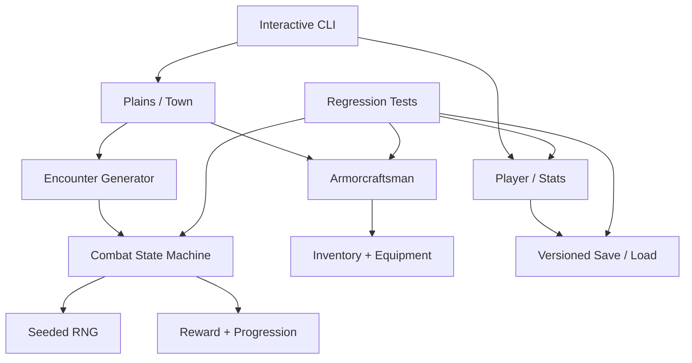

# Legacy C RPG — Shrek, Wolfskins and a Real Refactor

A full C11 modernization of one of my earliest student programs: a procedural text RPG containing zombies, werewolves, wolfskin armor, strange variable names and a **5% chance for Mighty .:SHREK:. to appear in the plains**.

The untouched historical source is preserved separately in [`legacy-student-rpg-original.c`](https://github.com/cagataykavas/legacy-student-rpg-original.c). This repository is the **after** side of the experiment: same game identity, explicit domain model, deterministic tests, safe input handling, save/load, modular combat and CI.

> The point is not to pretend the old program was good. The point is to show how I reason about preserving behavior while replacing structure.

## The original fossil

The original program is a single `main()` with state stored in names such as:

```text
STONKS
notgud
GOLDENEXPERIUNCU
REQUIEM
FIGHTINGOLD
acdc
SWITCHblade
```

It mixes:

- difficulty and stat allocation;
- overworld navigation;
- encounter generation;
- combat;
- healing and fleeing;
- loot;
- leveling;
- armor crafting;
- inventory/equipment state;
- terminal presentation;
- platform-specific `system("cls")` calls.

That original file remains untouched so the before/after comparison stays honest.

## Original behavior preserved from source

The modern implementation is grounded in the original code rather than a rewritten memory of it.

| Mechanic | Original behavior | Modern implementation |
|---|---:|---|
| Skill budget | `(5 - difficulty) * 5` | Preserved |
| Zombie encounter | 70% | Preserved |
| Werewolf encounter | 25% | Preserved |
| Shrek encounter | 5% | Preserved |
| Zombie | 200 HP / 1 AT | Preserved |
| Werewolf | 400 HP / 8 AT | Preserved |
| Mighty .:SHREK:. | 800 HP / 15 AT | Preserved |
| Zombie reward | 0–59 gold + 10 XP | Preserved |
| Werewolf reward | 0–79 gold + 1 wolfskin + 30 XP | Preserved |
| Shrek reward | **1 onion** | Preserved |
| Level threshold | 70 XP, then +40 per level | Preserved |
| Level stat gains | STR +1, STA +1, MA +1 | Preserved |
| Wolfskin Headguard | 150 gold + 1 skin, STA +2 | Preserved |
| Wolfskin Chestplate | 500 gold + 4 skins, STA +5 | Preserved |
| Wolfskin Leggings | 350 gold + 3 skins, STA +3 | Preserved |
| Wolfskin Boots | 250 gold + 2 skins, STA +1 | Preserved |
| Switchblade drop | `rand()%20*n*n > 80` | Recreated deliberately |

And yes, the encounter text is preserved exactly:

```text
Mighty .:SHREK:. appears!
```

Killing him gives an onion. That is not a joke added during the refactor; it is in the original student code.

## Intentional bug fixes vs compatibility mode

A modernization should not silently change behavior. `GameRules` therefore exposes two profiles.

### `RULES_MODERNIZED` — default

- block actually reduces damage;
- healing is capped at maximum HP;
- excess XP carries through a level-up;
- equipment toggles correctly;
- file paths and input handling are bounded;
- the game is portable instead of calling `system("cls")`.

### `RULES_LEGACY_FAITHFUL`

This profile intentionally recreates some historical quirks for regression/migration experiments:

- block is offered but has no defensive effect, matching the missing `case 2` in the original switch;
- healing may exceed max HP;
- level-up resets accumulated XP to zero instead of carrying overflow.

Run it with:

```bash
./build/legacy_rpg --legacy-rules
```

This makes the repository useful for code-migration experiments: a test can distinguish a **behavior-preserving migration** from an accidental gameplay rewrite.

## Architecture



## Repository layout

```text
legacy-c-rpg/
├── include/
│   └── game.h          # domain model + public API
├── src/
│   ├── game.c          # rules, player state, enemies, progression
│   ├── combat.c        # combat state machine + loot
│   ├── shop.c          # original wolfskin armor economy
│   ├── save.c          # versioned save/load validation
│   └── main.c          # playable CLI / overworld
├── tests/
│   └── test_game.c     # behavior and regression tests
├── .github/workflows/
│   └── ci.yml          # build, CTest, ASan, UBSan, CLI smoke
└── CMakeLists.txt
```

## Domain model

The original dozens of loose integers become explicit state:

```c
typedef struct {
    Stats base_stats;
    Inventory inventory;
    EquipmentPiece equipment[RPG_EQUIPMENT_SLOTS];
    int level;
    int experience;
    int next_level_xp;
    int hp;
    int victories;
    int retreats;
    int deaths;
} Player;
```

Enemies carry their own rewards, which prevents the old `n == 1`, `n == 2`, `n == 3` knowledge from leaking across the entire program:

```c
typedef struct {
    EnemyKind kind;
    const char *name;
    int max_hp;
    int hp;
    int attack;
    int xp_reward;
    int max_gold_reward;
    int wolfskin_reward;
    int onion_reward;
} Enemy;
```

That makes Shrek's onion an explicit domain fact rather than a hidden side effect near the bottom of `main()`.

## Combat state machine

Each player action produces a `CombatTurn` containing:

- player damage;
- enemy damage;
- healing;
- whether block had an effect;
- whether the player fled;
- resulting combat state.

```text
CONTINUES
   ├─ attack ──> enemy 0 HP ──> PLAYER_WON
   ├─ block ───> enemy attacks
   ├─ heal ────> enemy attacks
   ├─ run ─────> PLAYER_FLED
   └─ enemy hit drops player to 0 ──> PLAYER_DIED
```

This replaces the original `battle = ENEMYHP * charhp` sentinel, where multiplication of two mutable health values doubled as combat state.

## Equipment bug fixed explicitly

The original inventory used sequential independent `if` statements such as:

```c
if (equip==1 && head==1) c=c+2, head=2;
if (equip==1 && head==2) ... head=1;
```

After the first condition changes `head` from `1` to `2`, the second condition can immediately become true in the same iteration. The modern implementation represents ownership and equipped state as separate booleans and performs one atomic toggle.

The tests verify that equipping chest armor:

1. requires ownership;
2. adds the correct +5 stamina;
3. increases max HP consistently;
4. does not instantly unequip itself;
5. clamps HP correctly when later removed.

## Deterministic randomness

The original uses `srand(time(NULL))` and `rand()`, which makes gameplay tests difficult to reproduce.

The refactor uses a small explicit RNG state:

```c
Rng rng;
rng_seed(&rng, 42);
Enemy enemy = roll_enemy(&rng);
```

The CLI accepts a fixed seed:

```bash
./build/legacy_rpg --seed 42
```

This makes failures repeatable and is especially useful when this repository becomes a target for `agentic-migrator`.

## Save/load

`src/save.c` implements a versioned save record and validates it before mutating live player state.

Validation rejects impossible data such as:

- unsupported save versions;
- negative currencies;
- invalid level thresholds;
- equipped armor that is not owned;
- negative stats.

The load path reconstructs canonical armor metadata from the code instead of trusting serialized pointers or arbitrary item definitions.

## Build and play

```bash
cmake -S . -B build -DCMAKE_BUILD_TYPE=Release
cmake --build build --parallel
ctest --test-dir build --output-on-failure
./build/legacy_rpg --seed 42
```

Legacy-quirk profile:

```bash
./build/legacy_rpg --legacy-rules
```

## Tests

The regression suite covers:

- difficulty budgets;
- stat-budget validation;
- exact enemy HP/attack values;
- exact Shrek name and onion reward;
- original wolfskin armor prices/bonuses;
- equipment HP behavior;
- modern vs legacy XP overflow;
- modern vs legacy blocking;
- combat victory ordering;
- save/load round trips;
- inventory summary output.

CI builds with strict warnings and has a separate **AddressSanitizer + UndefinedBehaviorSanitizer** job.

## Why this belongs in the portfolio

This is intentionally not another greenfield CRUD demo. It shows a before/after engineering story:

```text
unstructured student code
        ↓
behavior inventory
        ↓
explicit compatibility decisions
        ↓
domain extraction
        ↓
deterministic test seams
        ↓
modular C11 implementation
        ↓
CI + sanitizers
        ↓
migration target for an agentic refactoring system
```

The interesting skill is deciding **what must remain identical, what is objectively a bug, and how to prove the difference with tests**.

## Agentic Migrator dogfooding target

This repository and the untouched original are natural inputs to [`agentic-migrator`](https://github.com/cagataykavas/agentic-migrator).

The planned migration experiment is not "ask an LLM to rewrite this file." Instead:

1. ingest the untouched historical source;
2. construct behavior tests from explicit original mechanics;
3. classify structural smells and unsafe patterns;
4. apply deterministic migration rules first;
5. run tests after each transformation;
6. ask an LLM only when a deterministic rule cannot resolve a concrete failure;
7. quarantine any learned migration rule until it passes regression cases;
8. compare the resulting implementation against this hand-designed reference architecture.

That gives the flagship migrator a real, ugly, personally-authored legacy target rather than a synthetic toy file.

## Historical note

The untouched source is intentionally embarrassing in places. That is useful. A portfolio containing only code written after learning best practices hides the most interesting part of engineering: **change over time**.

Also, Shrek has 800 HP and drops an onion. This is now regression-tested infrastructure.
