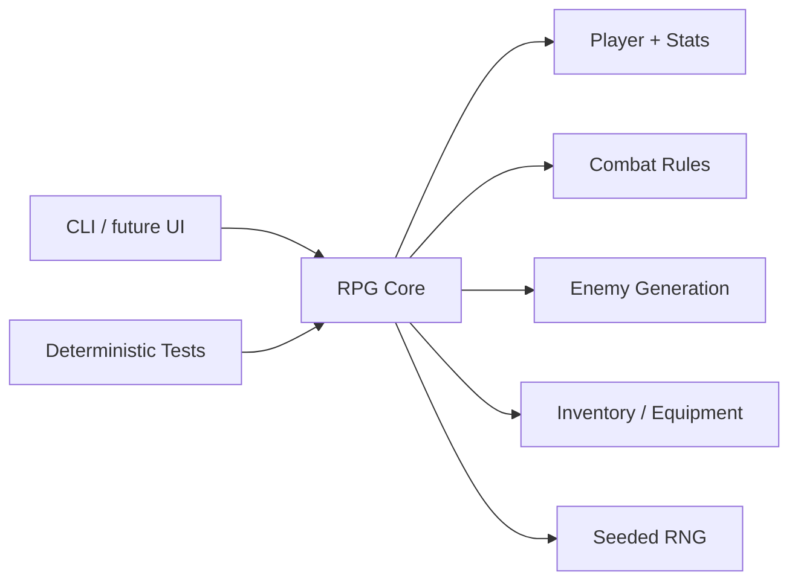

# Legacy C RPG — Refactoring Showcase

A modernization of an early student-era procedural C RPG. The original program is preserved separately in [`legacy-student-rpg-original.c`](https://github.com/cagataykavas/legacy-student-rpg-original.c); this repository focuses on redesigning the same domain into a testable C codebase.

## Architecture



## What changed

The original single-function program mixed input handling, random generation, combat, leveling, inventory and equipment state. The modern core separates domain state into explicit structs and enums, uses deterministic seeded random generation for repeatable tests, gives blocking an actual combat effect, and moves progression rules behind functions that can be validated independently.

The modernization intentionally preserves recognizable game behavior and one critical piece of cultural heritage:

> `Mighty .:SHREK:.`

## Build and test

```bash
cmake -S . -B build
cmake --build build
ctest --test-dir build --output-on-failure
```

## Engineering themes

- legacy-code modernization
- modular C11 design
- structs and enums for domain modeling
- deterministic RNG
- behavioral regression tests
- CMake / CTest
- separation of state, rules and presentation

## Agentic migration experiment

A future experiment will use the companion `agentic-migrator` project to convert selected legacy patterns under behavioral tests. Deterministic refactoring rules run first; failures can trigger LLM-assisted rule synthesis, with learned rules persisted only after they improve test results.

This is intentionally a before/after engineering artifact, not a claim that the student version was production-quality software.
